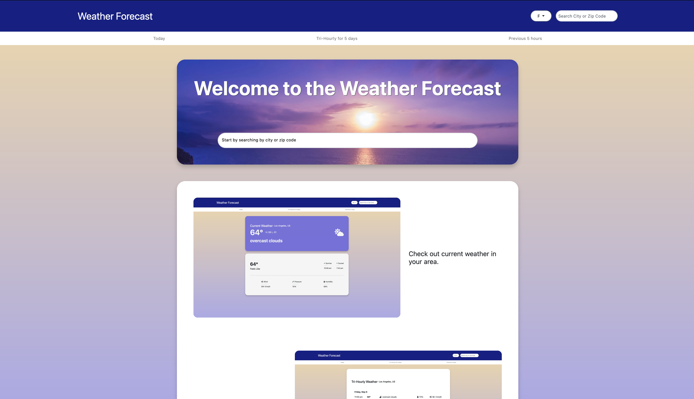
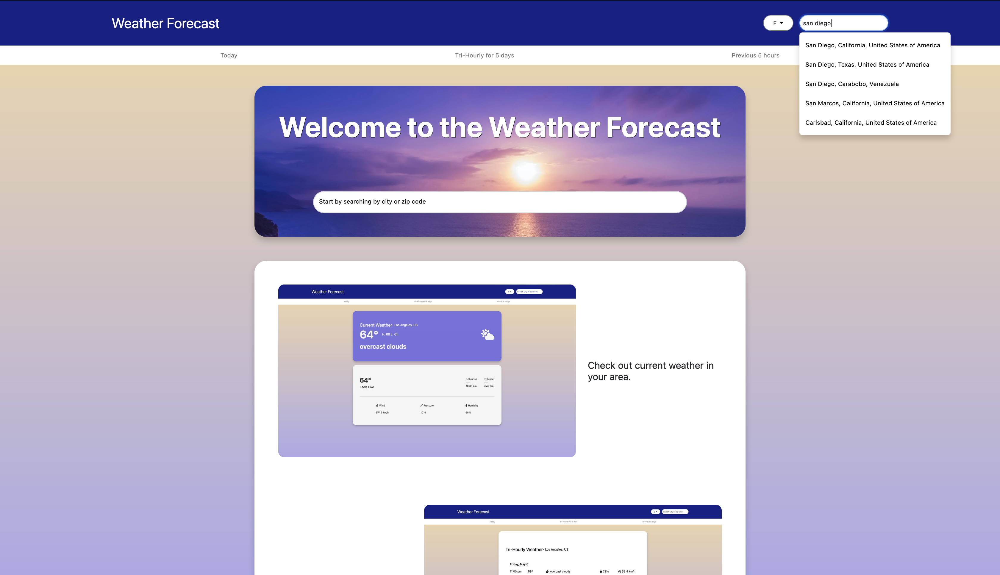
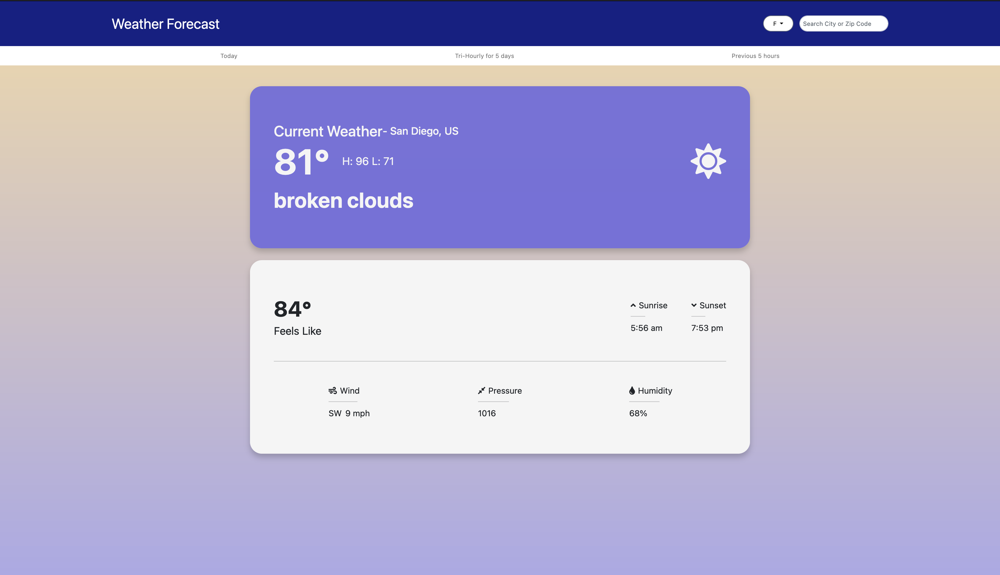
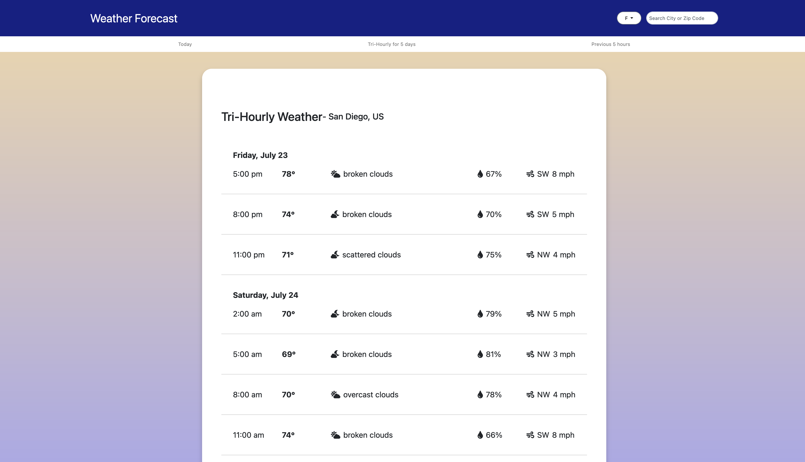
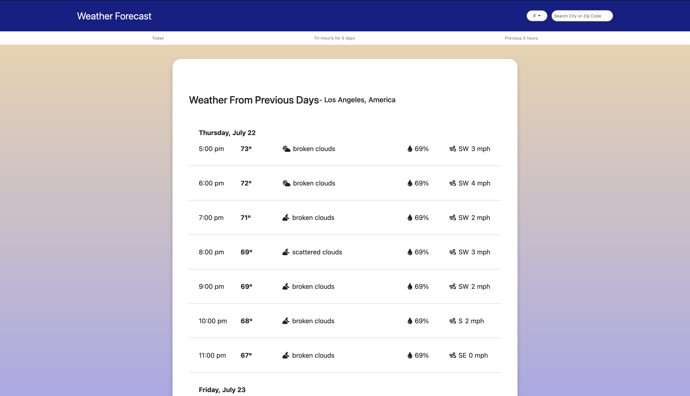
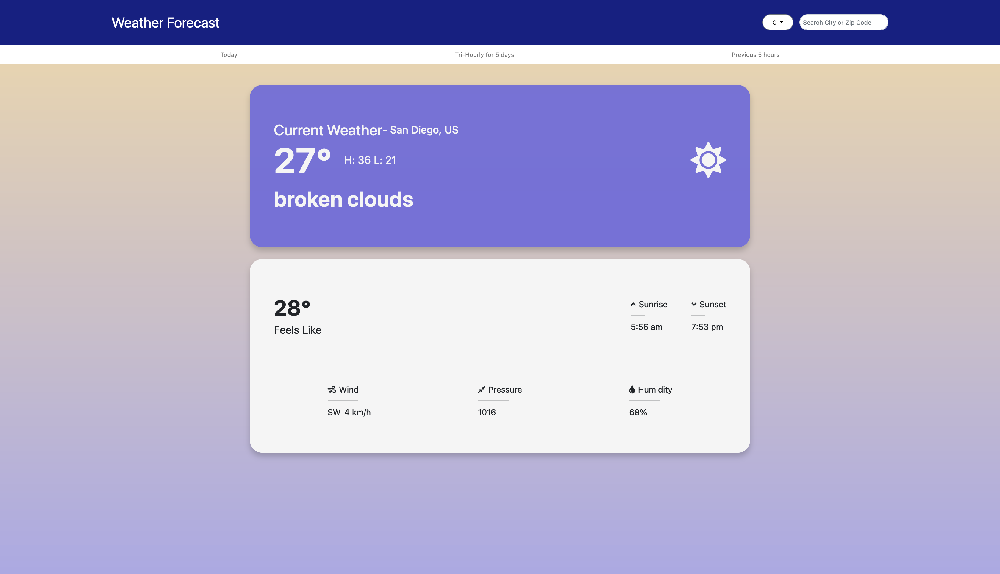

# **Weather Web App**

Weather app made to emulate websites like weather.com.

---

## Stack
- Angular
- TypeScript
- HTML/CSS

---

## Other Tools Used For Testing

- JSON-Server
- NodeJS

---

## APIs

- [Open Weather Map](https://rapidapi.com/community/api/open-weather-map/) 
  - For retrieving weather data.
- [LocationIQ](https://locationiq.com/) 
  - For retrieving city suggestions depending on user input

---

## Icons

- [Font Awesome](https://fontawesome.com/)

---

## Pages

### Landing Page:

I can enter a city I want to see the weather for either in the top right search bar or the center search bar.

I will get suggestions for cities based on what I input.

### Current Weather:

### Hourly Weather for Next 5 Days:

### Weather for Previous Days

### Units

If I wanted to see change the units used to show the weather I can by pressing the button on the top navigation next to the search bar.

I can choose either metric units or imperial units.

